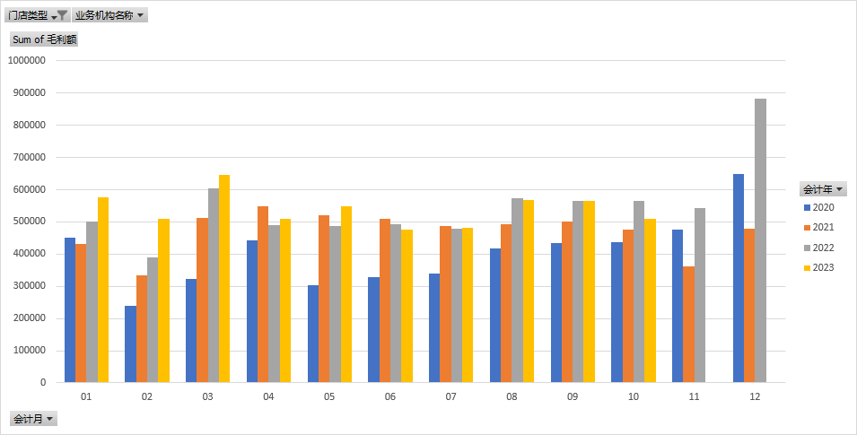
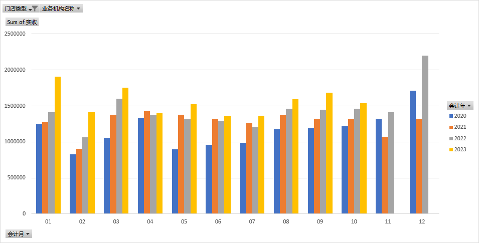
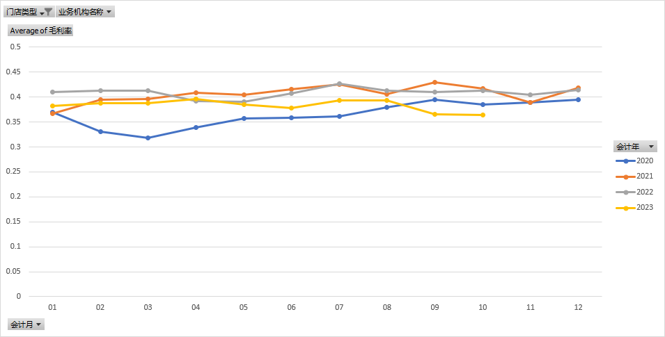

# Sales Analysis Project

## Overview
This document serves both as a README and a comprehensive report for the Sales Analysis Project. It is intended to provide readers with all necessary information about the project, including background, methodology, results, and conclusions. This approach ensures that all relevant details are accessible in a single, cohesive document, making it easier for interested parties to understand the full scope and findings of the project.

## 1. Introduction

This project aims to analyze sales data from a Chinese pharmaceutical retail chain company to uncover key insights into sales performance, profitability, and operational efficiencies. The analysis will focus on various metrics such as gross margin, net profit, operational expenses, and more.

The original dataset is in Chinese, so I have translated the column names and comments into English for this project.

### 1.1 Background

The dataset encompasses sales data from a Chinese pharmaceutical retail chain, which operates 20 stores. This dataset spans from January 2020 to September 2023, covering a period marked by the global COVID-19 pandemic. The company's product range is diverse, including prescription medications, over-the-counter drugs, and various health products. Notably, this is the first instance of the company undertaking a comprehensive data analysis endeavor. Prior to this, there was no systematic analysis conducted on the accumulated sales data, leaving a significant opportunity to derive actionable insights from this untapped resource.

### 1.2 Objectives

The primary objective of this analysis is to delve into the sales data post the onset of the COVID-19 pandemic, with a particular focus on understanding how external events and market dynamics during this period have influenced sales patterns. Specific goals include:

1. **Trend Analysis**: To analyze sales trends since the beginning of the COVID-19 pandemic, identifying key periods of change and their potential correlation with pandemic-related events.
2. **Strategic Insights**: To combine the sales data analysis with real-world events, aiming to provide strategic recommendations on how the company can adapt to the post-pandemic market environment.

Through this analysis, the aim is to not only offer a comprehensive overview of the company's sales trajectory during an unprecedented global event but also to equip the company with data-driven insights for strategic decision-making in a post-COVID era.

## 2. Data Description

### 2.1 Data Source and Cleaning Process

1. **Source**: The sales data are sourced directly from the company's internal sales system, while the office, heating, and rental expenses are provided by the finance department. Both sets of data are in standard spreadsheet format but required cleaning for optimal use.

2. **Data Privacy and Anonymization**: Due to privacy concerns, the original data cannot be shared publicly. I have provided a cleansed version of the data, in which random variables have been added to the sales data for anonymization purposes.

### 2.2 The final clean data spreadsheet 

The final spreadsheet has following columns:

| Column Name | English Name | Description |
| ----------- | ----------- | ----------- |
| 业务机构 | Store Code | The unique code for each store |
| 业务机构名称 | Store Name | The name of each store |
| 门店类型 | Store Type | "直营" means directly operated stores, "加盟" means franchise stores |
| 会计年 | Fiscal Year | The fiscal year of the sales data |
| 会计月 | Fiscal Month | The fiscal month of the sales data |
| 匹配列 | Match Column | The column used to match the sales data from the dataset |
| 毛利率 | Gross Margin | Gross profit divided by sales |
| 实收 | Net Sales | The actual sales amount |
| 毛利额 | Gross Profit | The gross profit amount |
| 防疫物资实收 | Anti-epidemic Supplies Sales | The sales amount of anti-epidemic supplies |
| 防疫物资毛利额 | Anti-epidemic Supplies Gross Profit | The gross profit amount of anti-epidemic supplies |
| 月租 | Monthly Rent | The monthly rent amount |
| 取暖费 | Heating Fee | The heating fee amount |
| 办公费 | Monthly Fee | The monthly fee including hydro, internet, etc. |
| 员工工资 | Salary | The salary amount |
| 净利润 | Net Profit | The net profit amount |

As part of the data cleaning process, special attention was given to the treatment of anti-epidemic supplies sales and gross profit. These figures are related to government orders, which are distinct from regular sales activities. Given that the company headquarters cannot directly account for these sales and they are instead included in the store-level sales data, it is essential to segregate them for accurate analysis. This separation ensures that our analysis of sales performance is reflective of the store operations. Consequently, anti-epidemic supplies sales and gross profits have been listed separately and excluded from the main sales performance analysis to maintain the integrity and relevancy of the findings.

## 3. Methodology

The methodology for this analysis is as follows:

### 3.1 **Data Preparation and Data Cleaning**

#### 3.1.1 Sales Data

Sales data is directly exported from the company's internal sales system. The data is in standard spreadsheet format but requires cleaning for optimal use. The following steps were taken to clean the data:
1. Remove columns with unnecessary information, including daily average sales, number of sales, number of customers, etc..
2. Remove rows with wrong values. Some sales data are incorrect due to system errors, so these rows are removed.
3. Add a marker column to combine 'Store Name' and 'Fiscal Month' together. In order to identify real sales from anti-epidemic supplies sales, an extra "F" is added manually to the marker column.

#### 3.1.2 Expense Data

The expense data is provided by the finance department. The data is in standard spreadsheet format with a strange format, therefore simply reshaping the data is everything needed.

#### 3.1.3 Data Merging

As this project requires an analysis based on month level, the sales data and expense data are merged together based on the marker column, separately for each store (with store code and store name for actual use in real world) and for each month (with fiscal year and fiscal month). 

Final version of data is saved at [clean_data.xlsx](./data/clean_data.xlsx). As of the time of this writing, the dataset is current through September 2023. Future updates will extend the analysis to include data through December 2023.

### 3.2 **Data Analysis and Visualization**

The analysis is conducted in Excel, with pivot tables and charts used to visualize the data. The pivot tables are created based on the merged data, with the following fields: store type in filter(only directly operated stores are considered), fiscal year in legend, fiscal month in axis, and the target attribute in values. The pivot tables are then converted into pivot charts for visualization.

## 4. Results and Discussion

### 4.1 Background Knowledge

Due to the lockdown policies in China during the COVID-19 pandemic, whenever there is a new wave of COVID-19 cases, the government will issue a lockdown order to the affected area. The lockdown order will require all residents to stay at home, and all stores (sometimes including supermarkets and pharmacies) to close. Changes caused by these lockdown orders will be pointed out in the analysis.

February is the month of Chinese New Year. During this period, people either stay at home or travel, so sales are usually lower than other months. This should also be taken into consideration when analyzing the data.

### 4.2 Gross Profit

The gross profit chart shows a steady increase in gross profit from 2020 to 2022. But in 2023, the gross profit is just slightly higher than 2022. After the COVID-19 pandemic, many local people choose to leave for big cities, which leads to a decrease in the population of the local area. In August 2023 and September 2023, some promotion activities are held to attract customers, which inevitably leads to a decrease in gross profit. but the strategy was not very successful.

### 4.3 Net Sales and Gross Margin

Net sales also have a steady increase from 2020 to 2022 (excluding November and December 2021 due to the lockdown order). The huge increase between December 2021 and December 2022 is because the ending of the dynamic-zero policy in China. A huge wave of infection of COVID-19 and winter flu happened in December 2022, which leads to a huge increase in sales. That wave lasted until early 2023. Starting from spring 2023, the net sales are all higher than the same period in 2022. 

However, the gross margin reveals a different story. The gross margin is increasing from 2020 to 2021, but that of 2022 was just a tiny bit higher than 2021. The gross margin of 2023 is even lower than 2022. Gross margin should not be affected by the number of sales, so the decrease in gross margin is a worrying sign. As what I have heard from the manager, this problem is complex because of the products structure, and procurement department and sales department are already working on it.

## 5. Conclusion

### 5.1 Overall Insights

**Restrictions**: It's hard to conclude from monthly rent and heating fee, because some stores were moved or closed, and some other stores were newly opened. But fortunately, net profit has a highly similar trend to gross profit, which is not surprising.

**Summary of Findings**: Our analysis reveals significant trends in sales and gross profit, influenced by factors such as the COVID-19 pandemic, demographic shifts, and the impact of promotional activities. 

**Future Outlook**: Based on our findings, the company may face certain challenges and opportunities in the future, reflecting changing market dynamics and evolving customer behaviors. Potential strategic adjustments might be needed in sales strategies, cost management, and product portfolio optimization.

**Recommendations**: Suggestions are made for strategic approaches, focusing on sales enhancement, cost efficiency, and adapting the product mix to align with current market trends.

#### 5.2 Limitations and Further Research

**Limitations**: Data is still incomplete, as the dataset only covers the period from January 2020 to September 2023. Future updates will extend the analysis to include data through December 2023.
**Areas for Future Research**: Future research could focus on the following areas: passenger flow analysis, product portfolio optimization, and cost management.

## 6. Acknowledgments

**Team Members and Colleagues**: Special thanks to colleagues who assisted in data collection, processing, and analysis.

**Management**: Appreciation is extended to the company's management for their support and guidance.

**Additional Support**: Gratitude is also due to others who provided technical resources or expertise.

## 7. Contact Information
If you have any questions or feedback, please feel free to contact me at `jnkylewang@outlook.com`.
